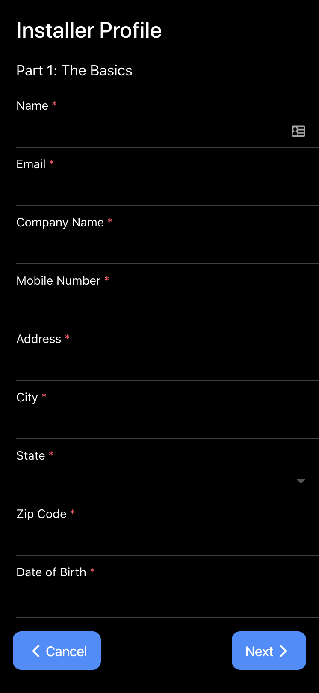

# GoCarrera POC

This codebase was generated using the Ionic CLI starter apps of tabs.

## Starting the App

In order to run this app you'll first want to do an `npm i` after installation is complete run `ionic serve`.

## RunDown

Once you have started the app you'll be shown this screen.

From this screen you'll want to click the button(click me) in the card.
Clicking the button will open a modal as shown below

Once the modal is open you can start filling out the form and either cancelling or navigating forward through the form.
If you navigate forward from the basics page you'll land on the insurance page. Here you'll see another form but at the bottom there's a new button(back). The back button will be on the following pages as well which will allow you to go back a step

git
